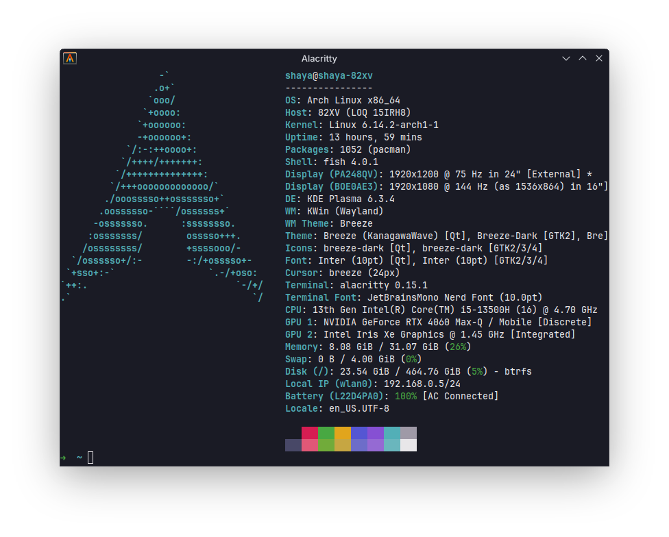

# Shaya's Dotfiles

<p align="center">
  
</p>

Personal configs, editors and desktop environment settings.

## Installation
1. Install [yay](https://github.com/Jguer/yay)
```sh
sudo pacman -S --needed git base-devel
git clone https://aur.archlinux.org/yay.git
cd yay
makepkg -si
```
2. Install [fish](https://github.com/fish-shell/fish-shell) ```$ yay -S fish```, set it as default shell ```$ chsh -s /usr/bin/fish``` and reboot.

3. Install [stow](https://github.com/aspiers/stow/) ```yay -S stow```

4. Clone repo and link dotfiles
```sh
cd .dotfiles
stow .
```
In case of conflicts with already existing configs, use ```stow --adopt .```
