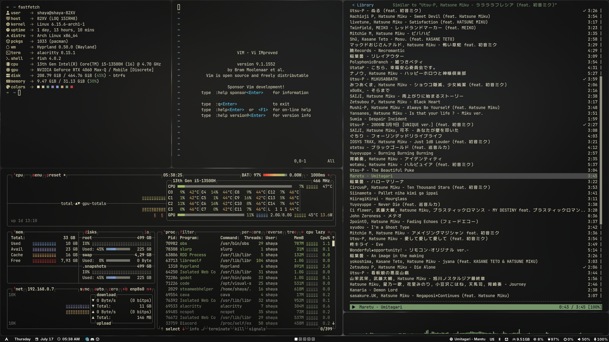

## Overview
* [split monitor workspaces](https://github.com/Duckonaut/split-monitor-workspaces) plugin to assign distinct workspaces per monitor
* CTRL as the mainMod key (no interference with common keybinds such as CTRL+S, CTRL+V, etc)
* Hardware cursor lag fix
* Color theme adjustments to match [Kanagawa Dragon](https://github.com/rebelot/kanagawa.nvim) palette
* No Kvantum. QT and GTK applications styled by separate fine tuned themes via `nwg-look` and `qt6ct-kde`
* No includes, single `hypr.config` file
* No gaps and borders
* Non-distracting, almost instant animations
* Sarasa UI and JetBrainsMono as primary ui and monospace fonts

## TODO
```
* Fix brightnessctl to control external monitor brightness levels.
* Notifications daemon styling (consider mako instead of dunst).
* Installation shell script
```

## Screenshots
<p align="center">
  
  
  
</p>


## Installation
These dots are not meant to be used by someone else, as they are highly customized to my personal preferences. However, if you are still willing to try, just clone the repo and replace the configs you are most interested in.

Additionally, check [Post Install Check List](https://github.com/shayaharuno/dotfiles/blob/master/CHECKLIST.md) for clean Arch + Hyprland installation

## Keybindings
* tofi - `ALT + SPACE`
* alacritty - `CTRL + BACKSLASH`
* kill active - `CTRL + Q`
* librewolf - `CTRL + B`
* obsidian - `CTRL + O`
* wlogout - `CTRL + ALT + DEL`
* keyboard layout switch - `SHIFT + ALT`
* disable all keybindings - `CTRL + HOME`
* select workspace - `CTRL + 1-5`
* switch workspace left / right - `CTRL + SHIFT + Arrow Left || Arrow Right`
* silently send to workspace - `CTRL + SHIFT + 1-5`
* logout - `CTRL + F12`
* kill waybar - `CTRL + SHIFT + F12`
* scratchpad - `SUPER + S`
* send to scratchpad - `SUPER + SHIFT + S`
* area screenshot - `SUPER + PGUP`
* fullscreen screenshot - `SUPER + PGDOWN`
* hyprpicker - `SUPER + P`

## Credits
- [Simple Hyprland](https://github.com/gaurav23b/simple-hyprland/tree/879dba81c84134072826a21453c15e553d03da2d)
- [CachyOS defaults](https://github.com/CachyOS/cachyos-hyprland-settings)
- [Hyprwm](https://github.com/hyprwm)
